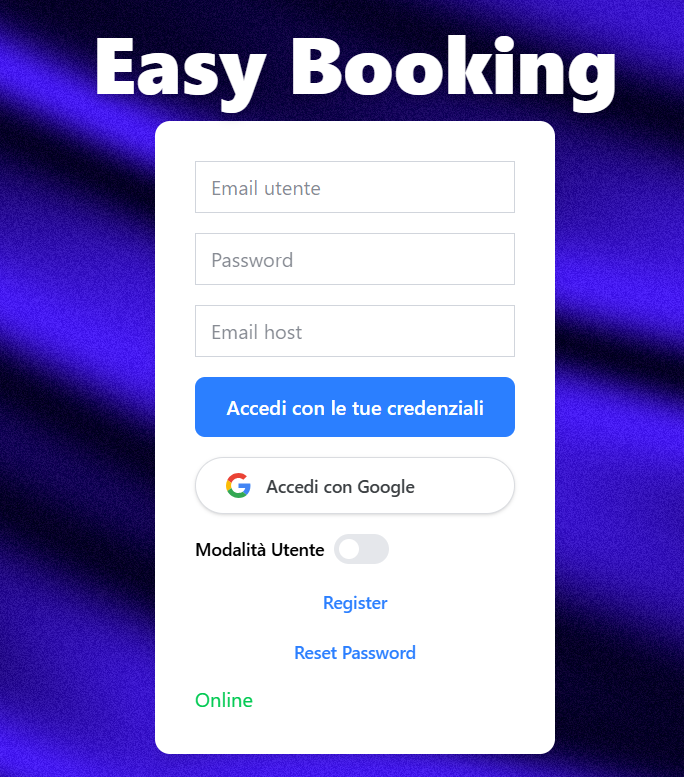

# Progetto Saw
[Easy Booking , clicca qui!](https://easy-booking-52608.web.app)

Gestisci le tue prenotazioni in modo veloce e facile

# Tecnologie utilizzate
- React
- Firebase
- Vite
- Tailwind
- Reactbits

# Guida all'uso:

- La schermata iniziale permettte di accedere al proprio account o creare un nuovo
- Lo switch permette di passare da modalità utente a modalità admin

## Modalità utente:
- Connettiti facilmente ai calendari creati dagli altri utenti, potrai visualizzare le tue prenotazioni e inserirne di nuove in pochi click. 

## Modalità admin:
- Connettiti al tuo calendario, visualizza tutte le prenotazioni ed elimina quelle indesiderate.
- In questa modalità hai il controllo totale del tuo calendario

## Guida all'installazione:
- WINDOWS: Utilizza chrome, ti spunterà in alto a destra aggiungi app al desktop
- IOS: Utilizza safari e tramite il comando condividi presente nei tre punti aggiungi la web app alla schermata home
- ANDROID: Utilizza chrome e tramite il comando condividi presente nei tre punti aggiungi la web app alla schermata home

## Modalità offline:
- Se dovessi perdere la connessione mentre utilizzi il calendario, nessun problema, i dati verrano aggiunti appena ritorni online
- ATTENZIONE: Devi prima accedere al calendario

## Notifiche
- Gli utenti riceveranno notifiche inerenti nuove prenotazioni o cacellazioni
- Le notifiche verranno inviate da Firebase Cloud Messaging e gestite da un Service Worker

### Progetto creato da:
- Stefano Carbone 
- s.carbone@studenti.unipi.it
- stefanocarbone30@gmail.com